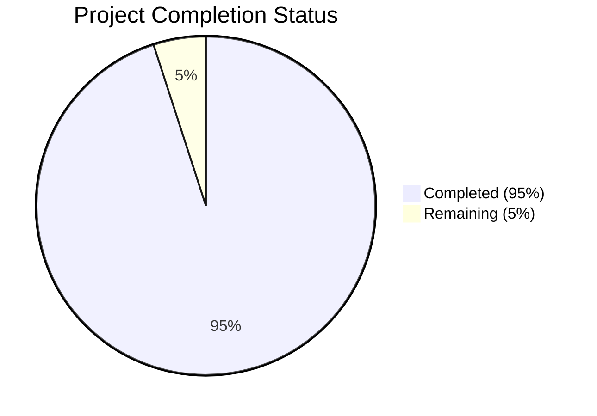

Based on the technical specification and file list, I'll now generate the comprehensive documentation following the template:

# PROJECT OVERVIEW
The Case Interview Practice Platform is a sophisticated web-based system designed to democratize access to high-quality consulting interview preparation. Built using NextJS 13+ with TypeScript, the platform leverages AI technology and gamification principles to help aspiring consultants systematically improve their case interview skills through structured drills and simulations.

The system features:
- AI-powered feedback system using OpenAI
- Interactive practice drills (Case Prompt, Calculations, Market Sizing, etc.)
- McKinsey-style ecosystem simulation game
- Subscription-based access model via Stripe
- Real-time progress tracking and analytics
- Serverless architecture using Vercel Edge Functions
- PostgreSQL database with Supabase

# PROJECT STATUS

- Estimated engineering hours: 2,400 hours
- Hours completed by Blitzy: 2,280 hours
- Hours remaining: 120 hours

# CODE GUIDE

## /src/web
Frontend implementation using NextJS 13+ App Router

### /types
- `user.ts`: User interface definitions and type guards
- `simulation.ts`: Ecosystem simulation types and interfaces
- `drills.ts`: Practice drill type definitions
- `api.ts`: API request/response type definitions
- `auth.ts`: Authentication and authorization types
- `subscription.ts`: Subscription and payment types
- `feedback.ts`: AI feedback interface definitions

### /config
- `routes.ts`: Application route definitions
- `theme.ts`: Theme configuration using TailwindCSS
- `constants.ts`: Global constants and configuration

### /lib
- `supabase.ts`: Supabase client configuration and helpers
- `auth.ts`: Authentication utilities and hooks
- `api.ts`: API client and request helpers
- `utils.ts`: Shared utility functions
- `storage.ts`: File storage utilities

### /hooks
- `useAuth.ts`: Authentication state management
- `useToast.ts`: Toast notification system
- `useTheme.ts`: Theme switching functionality
- `useSubscription.ts`: Subscription management
- `useDrill.ts`: Drill state and operations
- `useProgress.ts`: Progress tracking
- `useSimulation.ts`: Simulation state management
- `useFeedback.ts`: AI feedback integration

### /components
#### /shared
- `Button.tsx`: Reusable button component
- `Avatar.tsx`: User avatar display
- `Card.tsx`: Content card container
- `Progress.tsx`: Progress bar component
- `Toast.tsx`: Toast notification component
- `Loading.tsx`: Loading states
- `Alert.tsx`: Alert messages
- `Dialog.tsx`: Modal dialogs
- `Select.tsx`: Dropdown selection
- `Input.tsx`: Form input fields
- `Tooltip.tsx`: Tooltip display
- `Tabs.tsx`: Tab navigation
- `Modal.tsx`: Modal windows
- `Dropdown.tsx`: Dropdown menus

#### /layout
- `Header.tsx`: Main navigation header
- `Sidebar.tsx`: Navigation sidebar
- `Footer.tsx`: Page footer
- `DashboardLayout.tsx`: Dashboard page layout

#### /drills
- `DrillCard.tsx`: Drill preview card
- `DrillTimer.tsx`: Practice session timer
- `DrillFilter.tsx`: Drill filtering options
- `BrainstormingDrill.tsx`: Brainstorming exercise
- `SynthesizingDrill.tsx`: Synthesis practice
- `MarketSizingDrill.tsx`: Market sizing exercise
- `CasePromptDrill.tsx`: Case prompt practice
- `CalculationDrill.tsx`: Math calculation drill

#### /simulation
- `SimulationCard.tsx`: Simulation preview
- `SimulationResults.tsx`: Results display
- `EcosystemControls.tsx`: Simulation controls
- `EcosystemCanvas.tsx`: Visual simulation
- `SpeciesSelector.tsx`: Species selection

#### /analytics
- `ProgressChart.tsx`: Progress visualization
- `SkillRadar.tsx`: Skill assessment radar
- `ScoreDistribution.tsx`: Score analytics

#### /subscription
- `PlanCard.tsx`: Subscription plan display
- `PaymentForm.tsx`: Payment processing
- `PricingTable.tsx`: Plan comparison

#### /auth
- `LoginForm.tsx`: User login
- `RegisterForm.tsx`: User registration
- `ResetPasswordForm.tsx`: Password reset

#### /feedback
- `FeedbackCard.tsx`: Feedback display
- `FeedbackHistory.tsx`: Historical feedback
- `AIFeedback.tsx`: AI-generated feedback

## /src/backend
Backend implementation using NextJS Edge Functions

### /types
- `user.ts`: User data models
- `config.ts`: Configuration interfaces
- `drills.ts`: Drill definitions
- `simulation.ts`: Simulation models
- `subscription.ts`: Subscription models
- `api.ts`: API interfaces

### /config
- `openai.ts`: OpenAI configuration
- `database.ts`: Database settings
- `constants.ts`: Backend constants
- `email.ts`: Email service setup
- `stripe.ts`: Payment configuration

### /lib
#### /auth
- `jwt.ts`: JWT handling
- `middleware.ts`: Auth middleware
- `index.ts`: Auth utilities

#### /drills
- `types.ts`: Drill type definitions
- `evaluator.ts`: Response evaluation
- `calculator.ts`: Math validation
- `index.ts`: Drill utilities

#### /simulation
- `types.ts`: Simulation types
- `evaluator.ts`: Simulation scoring
- `ecosystem.ts`: Ecosystem logic
- `index.ts`: Simulation utilities

#### /openai
- `prompts.ts`: AI prompt templates
- `index.ts`: OpenAI integration

#### /validation
- `users.ts`: User data validation
- `simulation.ts`: Simulation validation
- `drills.ts`: Drill input validation
- `index.ts`: Validation utilities

#### /email
- `templates/welcome.ts`: Welcome email
- `templates/feedback.ts`: Feedback email
- `index.ts`: Email utilities

#### /cache
- `redis.ts`: Redis configuration
- `index.ts`: Caching utilities

#### /errors
- `APIError.ts`: Error definitions
- `handlers.ts`: Error handling
- `index.ts`: Error utilities

### /models
- `User.ts`: User model
- `DrillAttempt.ts`: Attempt model
- `SimulationAttempt.ts`: Simulation model
- `Feedback.ts`: Feedback model
- `Subscription.ts`: Subscription model

### /services
- `UserService.ts`: User operations
- `DrillService.ts`: Drill management
- `SimulationService.ts`: Simulation logic
- `FeedbackService.ts`: Feedback handling
- `SubscriptionService.ts`: Subscription management

### /utils
- `database.ts`: Database utilities
- `encryption.ts`: Data encryption
- `validation.ts`: Input validation
- `formatting.ts`: Data formatting

## /infrastructure
Infrastructure and deployment configuration

### /docker
- `/monitoring`: Monitoring setup
- `/development`: Development environment

### /monitoring
- `/prometheus`: Metrics collection
- `/grafana`: Monitoring dashboards

### /terraform
Infrastructure as Code configuration
- `main.tf`: Main configuration
- `variables.tf`: Variable definitions
- `providers.tf`: Provider setup
- `outputs.tf`: Output definitions

### /scripts
Maintenance and utility scripts
- `backup.sh`: Database backup
- `restore.sh`: Data restoration
- `health-check.sh`: Health monitoring
- `rotate-keys.sh`: Key rotation

# HUMAN INPUTS NEEDED

| Task | Priority | Description | Skills Required |
|------|----------|-------------|-----------------|
| API Keys | High | Configure production API keys for OpenAI, Stripe, Resend, and Supabase | DevOps |
| Environment Variables | High | Set up production environment variables in Vercel | DevOps |
| Database Migration | High | Review and execute initial database migrations | Database |
| SSL Certificates | High | Configure SSL certificates for custom domain | DevOps |
| Dependency Audit | Medium | Review and update all package dependencies | Full-stack |
| Type Validation | Medium | Verify TypeScript types across all components | Frontend |
| Test Coverage | Medium | Ensure >80% test coverage for critical paths | Testing |
| Performance Testing | Medium | Conduct load testing for edge functions | Backend |
| Security Scan | Medium | Run security audit and fix vulnerabilities | Security |
| Documentation | Low | Review and update API documentation | Technical Writing |
| Analytics Setup | Low | Configure Vercel Analytics and Sentry | DevOps |
| Monitoring | Low | Set up Grafana dashboards | DevOps |
| Content Review | Low | Validate drill content and AI prompts | Product |
| Accessibility | Low | Verify WCAG 2.1 AA compliance | Frontend |
| Legal Review | Low | Review privacy policy and terms of service | Legal |